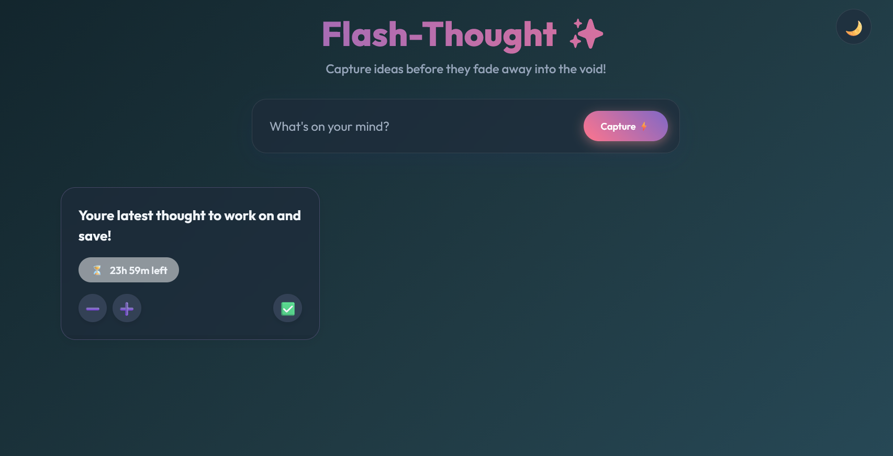

# Flash-Thought ✨

My first ever github app release - albeit by basically only using ai.

A rapid, intentional note-taking; task completion scratchpad with a built-in self-destruct mechanism. 
Made this so I can actually remind myself of the things I wanted to/am supposed to do and a timer to count down 
before how long I was supposed to do it.

 


## 🚀 Built With
* React / Vite
* BlockNote (Obsidian-style WYSIWYG Markdown Editor)
* Vanilla CSS with Glassmorphism
* Orchestrated and generated autonomously using **Google Antigravity** - prompted by Aga2522

## ⚡ Features
- **Time-To-Live (TTL)**: Notes degrade visually (pulse, panic, turn red) as time runs out.
- **Dark Mode Default**: Sleek, immersive theme out-of-the-box with a light mode toggle.
- **Obsidian-Style Editor**: Click any note card to open a beautiful, distraction-free rich text modal inline editor.
- **Time Controls**: "Feed" a thought to give it 1 more hour, or fast-forward time to watch it panic!

## 🛠️ How to Run Locally
1. Clone the repository
   ```bash
   git clone <your-repo-url>
   ```
2. Navigate into the directory
   ```bash
   cd flash-thought
   ```
3. Install dependencies
   ```bash
   npm install
   ```
4. Start the development server
   ```bash
   npm run dev
   ```
5. Open `http://localhost:5173` in your browser.

## 📝 Usage
- **Capture**: Type your thought in the top bar and hit "Capture ⚡". Type "short" anywhere in your text to test a 10-second panic note!
- **Edit**: Click the body of any Note card to open the BlockNote editor.
- **Feed**: Click the ➕ icon on a note to add +1 Hour to its life.
- **Process**: Click the ✅ icon to process/delete the note intentionally.
